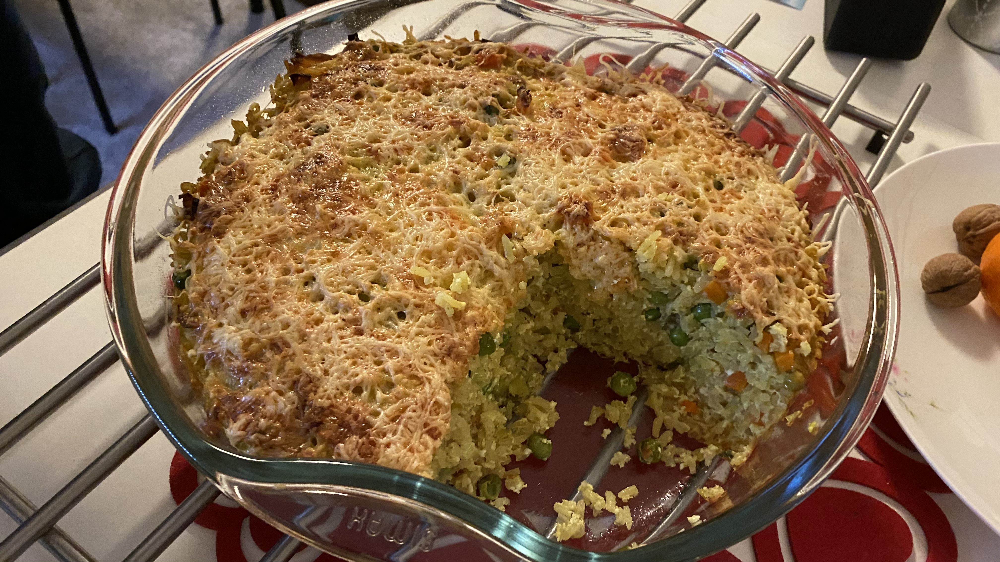

---
categories:
- Reis
date: '2024-02-10 00:00:00'
image: IMG_5942.JPEG
slug: reisauflauf
tags: []
title: Reisauflauf
---

Dauert zwar lange im Ofen, kann man aber gut mit ins Büro nehmen

<svg xmlns="http://www.w3.org/2000/svg" class="icon icon-tabler icon-tabler-clock" width="17" height="17" viewBox="0 0 22 22" stroke-width="2" stroke="currentColor" fill="none" stroke-linecap="round" stroke-linejoin="round">
  <path stroke="none" d="M0 0h24v24H0z"></path>
  <circle cx="12" cy="12" r="9"></circle>
  <polyline points="12 7 12 12 15 15"></polyline>
</svg> Die Zubereitung dauert ca. 70 Minuten.

 

> Wo gefunden? Im Kochbuch 'Emmi kocht einfach' auf Seite 92.

Guten Appetit! :)